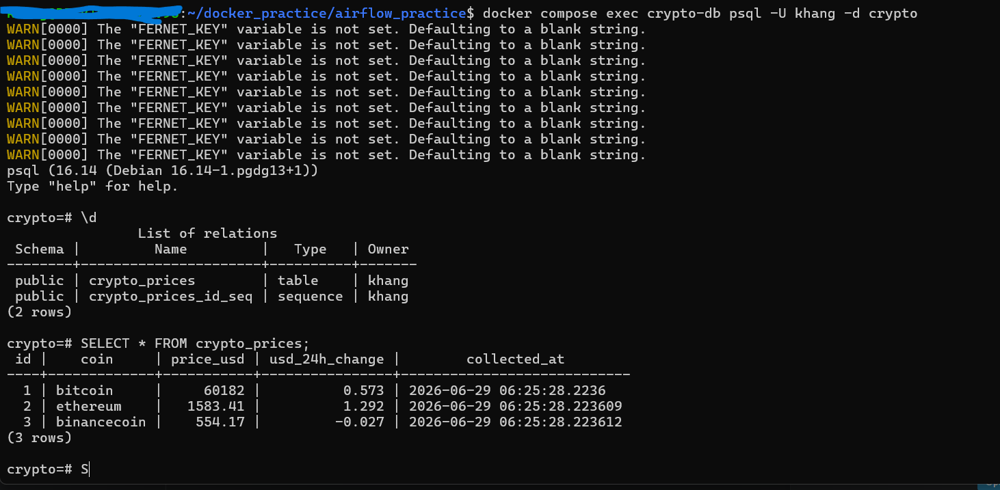
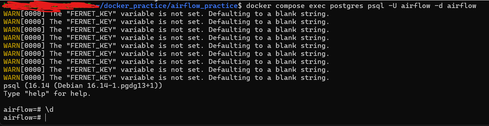
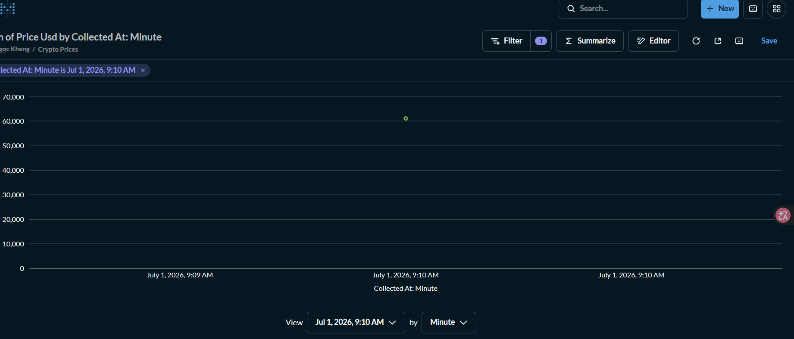

# Crypto Price ETL Pipeline with Airflow

An end-to-end ETL pipeline that automatically collects cryptocurrency 
prices from CoinGecko API, transforms and loads the data into PostgreSQL,
orchestrated by Apache Airflow — all running in Docker.

## Architecture
CoinGecko API → Extract → Transform → Load → PostgreSQL (crypto-db)
↓
Metabase Dashboard
↑
Apache Airflow (hourly schedule)
## Tech Stack

| Layer | Technology |
|---|---|
| Orchestration | Apache Airflow 3.2.2 |
| Data Source | CoinGecko API (Bitcoin, Ethereum, BNB) |
| Transform | Python 3.10 (pandas) |
| Storage | PostgreSQL 15 |
| Visualization | Metabase |
| Infrastructure | Docker Compose |

## Project Structure
airflow_practice/
├── dags/
│   ├── crypto_pipeline.py   # Airflow DAG definition
├── plugins/
│   ├── extract.py           # Calls CoinGecko API
│   ├── transform.py         # Cleans and structures data
│   └── load.py              # Writes to PostgreSQL
├── logs/
├── config/
├── docker-compose.yaml      # Airflow + crypto-db + Metabase
├── .env.example
└── README.md
## How It Works

1. **Extract** — Airflow triggers `extract.py` every hour, calling 
   CoinGecko API to get current prices of Bitcoin, Ethereum, 
   and BNB in USD with 24h change percentage.

2. **Transform** — `transform.py` normalizes the raw JSON response 
   into structured records, rounds values, and adds a UTC timestamp.

3. **Load** — `load.py` creates the `crypto_prices` table if it doesn't 
   exist, then inserts the transformed records using SQLAlchemy.

4. **Visualize** — Metabase connects to `crypto-db` and displays 
   price trends over time on an interactive dashboard.

## DAG Overview
- Schedule: `@hourly`
- Retries: 2 (with 1 minute delay)
- Owner: khang
- Catchup: disabled

## Setup & Run

### Prerequisites
- Docker Desktop installed and running
- CoinGecko API key (free tier available at coingecko.com)

### Steps

**1. Clone the repository**
```bash
git clone <your-repo-url>
cd airflow_practice
```

**2. Create environment file**
```bash
cp .env.example .env
# Edit .env and fill in your values
```

**3. Generate Airflow UID (Linux/WSL)**
```bash
echo "AIRFLOW_UID=$(id -u)" >> .env
```

**4. Initialize Airflow metadata database**
```bash
docker-compose up airflow-init
```
This creates all necessary tables in the Airflow metadata database 
and sets up the default admin user (airflow/airflow).

**5. Start all services**
```bash
docker-compose up -d
```

**6. Access the interfaces**

| Service | URL | Credentials |
|---|---|---|
| Airflow UI | http://localhost:8080 | airflow / airflow |
| Metabase | http://localhost:3000 | Set on first login |

**7. Enable and trigger the DAG**

- Open http://localhost:8080
- Find `crypto_etl_pipeline`
- Toggle the DAG to **On**
- Click **Trigger** to run immediately

**8. Connect Metabase to crypto-db**
In Metabase setup wizard, add a PostgreSQL connection:
Host:     crypto-db
Port:     5432
Database: <your CRYPTO_DB_NAME from .env>
Username: <your CRYPTO_DB_USER from .env>
Password: <your CRYPTO_DB_PASSWORD from .env>
## Environment Variables

Copy `.env.example` to `.env` and fill in:
## Key Learnings

- **Docker Compose multi-service setup** — orchestrating Airflow 
  (webserver, scheduler, worker, triggerer, dag-processor), 
  PostgreSQL, Redis, and Metabase in one stack
- **Airflow DAG design** — PythonOperator, XCom for passing data 
  between tasks, retry logic, schedule configuration
- **Separation of concerns** — dedicated `crypto-db` separate from 
  Airflow metadata database to avoid credential conflicts
- **Environment variable management** — avoiding hardcoded credentials, 
  using prefix naming (`CRYPTO_DB_*`) to prevent conflicts with 
  Airflow system variables
- **Centralized logging** — Python logging module across all pipeline 
  modules with file and console handlers
- **Docker networking** — understanding why container hostnames 
  (e.g. `crypto-db`) are used instead of `localhost` for 
  inter-container communication

## Screenshots

### Meta database 


### Crypto database


### Metabase Dashboard — Price trends over time


## What I Would Improve Next

- Migrate pipeline to GCP (Pub/Sub → Dataflow → BigQuery)
- Add data quality validation task before load step
- Add Airflow email alerts on DAG failure
- Implement incremental loading to avoid duplicate records
- Add more coins and additional metrics (market cap, volume)
